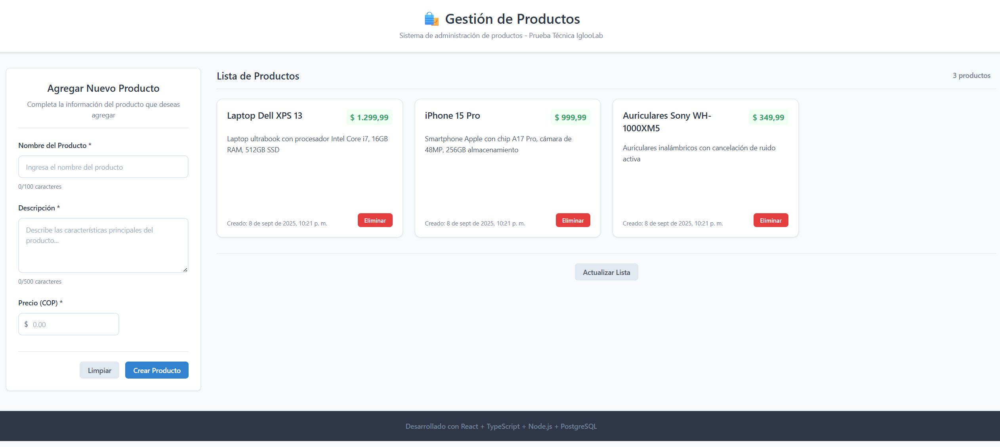

# 🛍️ Sistema de Gestión de Productos - IglooLab Tech Test

Aplicación web Full Stack para gestionar inventario de productos con React + Node.js + PostgreSQL.

## 🚀 Ejecución Rápida

### 📋 Prerrequisitos
- Node.js v18+ ([Descargar](https://nodejs.org/))
- Docker ([Descargar](https://www.docker.com/))

### ⚡ Pasos para Ejecutar

**1. Clonar proyecto**
```bash
git clone https://github.com/Danidiaz0799/igloolab-tech-test.git
cd igloolab-tech-test
```

**2. Levantar Base de Datos**
```bash
docker-compose up -d
```

**3. Ejecutar Backend** (Terminal 1)
```bash
cd backEnd
npm install
# Copiar variables de entorno y configurar según tu sistema
cp .env.example .env
npm run dev
```
✅ Backend corriendo en: http://localhost:3001

**4. Ejecutar Frontend** (Terminal 2)
```bash
cd frontEnd
npm install
npm run dev
```
✅ Frontend corriendo en: http://localhost:5173

### 🎯 Acceso a la Aplicación
Abrir navegador en: **http://localhost:5173**

---

## 🛠️ Stack Tecnológico

| Componente | Tecnología |
|------------|------------|
| Frontend | React 18 + TypeScript + Vite |
| Backend | Node.js + Express + TypeORM |
| Base de Datos | PostgreSQL 15 + Docker |
| API | RESTful con validación completa |

## 📁 Estructura del Proyecto

```
📦 igloolab-tech-test
├── 📱 frontEnd/          # React + TypeScript
├── 🔧 backEnd/           # Node.js + Express API
├── 🗄️ database/          # PostgreSQL scripts
└── 🐳 docker-compose.yml # Base de datos
```

## 🔗 API Endpoints

| Método | URL | Descripción |
|--------|-----|-------------|
| GET | `/api/products` | Listar productos |
| POST | `/api/products` | Crear producto |
| DELETE | `/api/products/:id` | Eliminar producto |

## ✅ Funcionalidades

- ➕ Crear productos con validación
- 📋 Listar productos en tiempo real
- 🗑️ Eliminar productos
- 📱 Diseño responsive
- ⚡ Interfaz moderna y rápida

## 🔧 Configuración Técnica

### Variables de Entorno (Backend)
**Copiar `.env.example` a `.env` y ajustar si es necesario:**
```env
PORT=3001
DB_HOST=localhost
DB_PORT=5432
DB_USERNAME=postgres
DB_PASSWORD=password
DB_NAME=products_db
NODE_ENV=development
```

### Puertos de la Aplicación
- **Frontend**: http://localhost:5173
- **Backend**: http://localhost:3001
- **PostgreSQL**: localhost:5432

---

## 💡 Funcionalidades Implementadas

### 🎨 Frontend (React + TypeScript)
1. **📋 Lista de Productos**
   - Visualización en grid responsivo
   - Formateo de precios en pesos colombianos (COP)
   - Botones de eliminación con confirmación
   - Estados de carga y manejo de errores
   - Actualización automática después de operaciones

2. **📝 Formulario de Productos**
   - Validación en tiempo real con React Hook Form
   - Campos requeridos: nombre, descripción, precio
   - Vista previa del precio formateado
   - Mensajes de éxito y error contextuales
   - Limpieza automática después de envío exitoso

3. **🔄 Gestión de Estado**
   - React Context API para estado global
   - useReducer para manejo de estado complejo
   - Hooks personalizados para reutilización
   - Separación clara entre lógica y presentación

### ⚙️ Backend (Node.js + Express + TypeORM)
1. **🛡️ API RESTful Robusta**
   - Estructura modular con controladores
   - Validación comprehensiva de datos
   - Manejo de errores centralizado
   - Respuestas JSON consistentes

2. **🗄️ Integración con Base de Datos**
   - Entidad Product con TypeORM
   - Validaciones a nivel de base de datos
   - Timestamps automáticos (created_at, updated_at)
   - Índices para optimización de consultas


## 🗄️ Esquema de Base de Datos

### 📋 Tabla: products
```sql
CREATE TABLE products (
    id SERIAL PRIMARY KEY,
    name VARCHAR(100) NOT NULL,
    description TEXT NOT NULL,
    price DECIMAL(12, 2) NOT NULL CHECK (price >= 0),
    created_at TIMESTAMP DEFAULT CURRENT_TIMESTAMP,
    updated_at TIMESTAMP DEFAULT CURRENT_TIMESTAMP
);
```

## 🛡️ Consideraciones de Seguridad

- ✅ **Validación dual** - Frontend y backend validan datos
- ✅ **Variables de entorno** - Configuración sensible protegida
- ✅ **CORS configurado** - Políticas de origen cruzado
- ✅ **Sanitización ORM** - TypeORM previene SQL injection
- ✅ **TypeScript** - Type safety en tiempo de compilación
- ✅ **Error handling** - No exposición de datos sensibles

### �️ Tecnologías Dominadas
- Frontend: React, TypeScript, HTML5, CSS3, JavaScript
- Backend: Node.js, Express, RESTful APIs
- Base de Datos: PostgreSQL, MySQL
- DevOps: Docker, Git, CI/CD
- Herramientas: VSCode, Postman, DBeaver

---

## 📝 Notas Técnicas Importantes

### 🔍 Decisiones de Arquitectura
- **React Context vs Redux**: Se eligió Context API por simplicidad y tamaño del proyecto
- **TypeORM vs Prisma**: TypeORM por decorators y familiaridad con TypeScript
- **Vite vs CRA**: Vite por velocidad de build y HMR superior
- **PostgreSQL vs MySQL**: PostgreSQL por robustez y características avanzadas

## � Versión Móvil React Native

### 🚀 **App Móvil Desarrollada**

Además de la versión web, se desarrolló una **aplicación móvil nativa** con React Native que replica la funcionalidad de la lista de productos.

#### 📁 **Ubicación del Proyecto**
```
📦 igloolab-tech-test/
├── 🎨 frontEnd/              # React web
├── 🔧 backEnd/               # Node.js API  
├── 📱 ProductsAppMobile/     # 🆕 React Native app
└── ...
```

#### ⚡ **Ejecución de la App Móvil**
```bash
# Navegar al proyecto móvil
cd ProductsAppMobile

# Instalar dependencias (solo primera vez)
npm install

# Iniciar la aplicación
npm start

# Opciones de testing:
# - Presionar 'w' para web browser
# - Presionar 'a' para Android simulator  
# - Escanear QR con Expo Go app en tu teléfono
```

#### ⚠️ **Configuración Importante para Testing Móvil**

**Para probar en dispositivos físicos** (Android/iOS con Expo Go), es necesario configurar la IP local:

1. **Obtener tu IP local** (Windows):
   ```bash
   ipconfig
   ```
   Buscar la IP en `Adaptador de LAN inalámbrica Wi-Fi` → `Dirección IPv4`

2. **Actualizar archivo de configuración**:
   ```bash
   # Editar: ProductsAppMobile/src/services/apiClient.ts
   # Cambiar esta línea:
   const API_BASE_URL = 'http://192.168.20.46:3001'; // IP de la máquina host
   
   # Por tu IP local, ejemplo:
   const API_BASE_URL = 'http://TU_IP_LOCAL:3001';
   ```

3. **Asegurar que el backend acepte conexiones de red**:
   - El backend ya está configurado para aceptar conexiones desde cualquier IP de la red local
   - Solo cambiar la IP en `apiClient.ts` y reiniciar la app móvil

#### 🎯 **Funcionalidades Implementadas**
- ✅ **Lista de productos** con datos dummy (10 productos)
- ✅ **Búsqueda en tiempo real** por nombre y descripción
- ✅ **Formateo de precios** en pesos colombianos (COP)
- ✅ **Pull to refresh** para actualizar datos
- ✅ **Diseño responsive** para diferentes tamaños
- ✅ **Animaciones suaves** y feedback táctil
- ✅ **TypeScript** con types seguros
- ✅ **Navegación optimizada** para móvil

#### 📱 **Stack Tecnológico Móvil**
| **Componente** | **Tecnología** |
|----------------|----------------|
| **Framework** | React Native + Expo |
| **Lenguaje** | TypeScript |
| **UI Components** | React Native Core |
| **Navigation** | Expo Router (preparado) |
| **Testing** | Expo Go + Web + Simulators |

#### 🎨 **Características de Diseño**
- **Material Design** inspirado
- **Cards con sombras** y elevación
- **Colores coherentes** con la versión web
- **Typography** optimizada para móvil
- **Touch targets** de tamaño adecuado
- **Loading states** y empty states

#### 🔧 **Estructura del Proyecto Móvil**
```
📱 ProductsAppMobile/
├── src/
│   ├── components/
│   │   ├── ProductCard.tsx      # Tarjeta individual
│   │   ├── ProductsList.tsx     # Lista principal
│   │   └── index.ts            # Exports
│   ├── data/
│   │   └── dummyProducts.ts    # Datos estáticos
│   ├── types/
│   │   └── product.ts          # Interfaces TS
├── App.tsx                     # Componente raíz
└── package.json
```

#### 📸 **Vista Previa de Funcionalidades**
1. **Lista Principal**: Grid de productos con scroll vertical
2. **Búsqueda**: Input con filtrado instantáneo
3. **Tarjetas**: Información completa con precios destacados
4. **Responsive**: Adaptable a diferentes tamaños de pantalla
5. **Estados**: Loading, empty, error handling

---

## �🔄 Migración a C# ASP.NET Core

### 🎯 **Replicación de la API RESTful en C#**

La API actual de Node.js/Express puede ser fácilmente replicada en **ASP.NET Core** manteniendo la misma funcionalidad y estructura.

#### 📋 **Stack Tecnológico Equivalente**
| **Componente** | **Node.js** | **C# ASP.NET** |
|----------------|-------------|----------------|
| **Framework** | Express.js | ASP.NET Core 8 |
| **ORM** | TypeORM | Entity Framework Core |
| **Base de Datos** | PostgreSQL | PostgreSQL/SQL Server |
| **Validación** | Middleware custom | Data Annotations |
| **DI Container** | Manual | Built-in DI |

#### 🛠️ **Estructura del Proyecto C#**
```
📦 ProductsAPI/
├── 🎯 Controllers/
│   └── ProductsController.cs      # Endpoints API
├── 🗄️ Models/
│   └── Product.cs                 # Entity model
├── 💾 Data/
│   └── ApplicationDbContext.cs    # DbContext
├── 📦 DTOs/
│   ├── CreateProductDto.cs        # Request models
│   └── ProductResponseDto.cs      # Response models
├── ⚙️ Services/
│   └── IProductService.cs         # Business logic
└── 📄 Program.cs                  # Application setup
```

#### 💻 **Implementación de los Endpoints**

**1. Modelo de Producto (Product.cs)**
```csharp
using System.ComponentModel.DataAnnotations;

public class Product
{
    public int Id { get; set; }

    [Required]
    [StringLength(100)]
    public string Name { get; set; }

    [Required]
    public string Description { get; set; }

    [Required]
    [Range(0, double.MaxValue)]
    public decimal Price { get; set; }

    public DateTime CreatedAt { get; set; } = DateTime.UtcNow;
    public DateTime UpdatedAt { get; set; } = DateTime.UtcNow;
}
```

**2. DbContext (ApplicationDbContext.cs)**
```csharp
using Microsoft.EntityFrameworkCore;

public class ApplicationDbContext : DbContext
{
    public ApplicationDbContext(DbContextOptions<ApplicationDbContext> options)
        : base(options) { }

    public DbSet<Product> Products { get; set; }

    protected override void OnModelCreating(ModelBuilder modelBuilder)
    {
        modelBuilder.Entity<Product>()
            .Property(p => p.Price)
            .HasPrecision(12, 2);
    }
}
```

**3. Controller (ProductsController.cs)**
```csharp
using Microsoft.AspNetCore.Mvc;
using Microsoft.EntityFrameworkCore;

[ApiController]
[Route("api/[controller]")]
public class ProductsController : ControllerBase
{
    private readonly ApplicationDbContext _context;
    public ProductsController(ApplicationDbContext context)
    {
        _context = context;
    }

    [HttpGet]
    public async Task<ActionResult<IEnumerable<Product>>> GetProducts()
    {
        return await _context.Products.ToListAsync();
    }

    [HttpPost]
    public async Task<ActionResult<Product>> CreateProduct(CreateProductDto dto)
    {
        var product = new Product
        {
            Name = dto.Name,
            Description = dto.Description,
            Price = dto.Price
        };
        _context.Products.Add(product);
        await _context.SaveChangesAsync();
        return CreatedAtAction(nameof(GetProducts), new { id = product.Id }, product);
    }

    [HttpDelete("{id}")]
    public async Task<IActionResult> DeleteProduct(int id)
    {
        var product = await _context.Products.FindAsync(id);
        if (product == null) return NotFound();
        _context.Products.Remove(product);
        await _context.SaveChangesAsync();
        return NoContent();
    }
}
```

**4. Configuration (Program.cs)**
```csharp
using Microsoft.EntityFrameworkCore;

var builder = WebApplication.CreateBuilder(args);

// Services
builder.Services.AddControllers();
builder.Services.AddDbContext<ApplicationDbContext>(options =>
    options.UseNpgsql(builder.Configuration.GetConnectionString("DefaultConnection")));

// CORS
builder.Services.AddCors(options =>
{
    options.AddPolicy("AllowReactApp",
        policy => policy.WithOrigins("http://localhost:5173")
                        .AllowAnyHeader()
                        .AllowAnyMethod());
});

var app = builder.Build();

// Pipeline
app.UseCors("AllowReactApp");
app.UseRouting();
app.MapControllers();

app.Run();
```

#### ⚙️ **Configuración de Conexión**
**appsettings.json:**
```json
{
  "ConnectionStrings": {
    "DefaultConnection": "Host=localhost;Database=products_db;Username=postgres;Password=password"
  },
  "Logging": {
    "LogLevel": {
      "Default": "Information"
    }
  }
}
```

#### 🚀 **Comandos para Setup**
```bash
# Crear proyecto
dotnet new webapi -n ProductsAPI
cd ProductsAPI

# Instalar packages
dotnet add package Microsoft.EntityFrameworkCore
dotnet add package Microsoft.EntityFrameworkCore.Design
dotnet add package Npgsql.EntityFrameworkCore.PostgreSQL

# Ejecutar migraciones
dotnet ef migrations add InitialCreate
dotnet ef database update

# Ejecutar aplicación
dotnet run  # http://localhost:5000
```

#### 🔍 **Ventajas de ASP.NET Core**
- ✅ **Performance superior** - Mejor rendimiento que Node.js
- ✅ **Type safety nativo** - C# fuertemente tipado
- ✅ **Ecosystem maduro** - NuGet, Entity Framework
- ✅ **Escalabilidad** - Mejor para aplicaciones empresariales
- ✅ **Debugging avanzado** - Visual Studio integration
- ✅ **Deploy sencillo** - IIS, Azure, Docker

---

*Este proyecto demuestra competencias sólidas en desarrollo Full Stack moderno aplicando las mejores prácticas de la industria y enfoque en experiencia de usuario.*

- **Frontend**: React con TypeScript y Vite
- **Backend**: Node.js con TypeScript, Express y TypeORM
- **Base de datos**: MySQL
- **API RESTful** con validación de datos
- **Interfaz responsiva** para gestión de productos